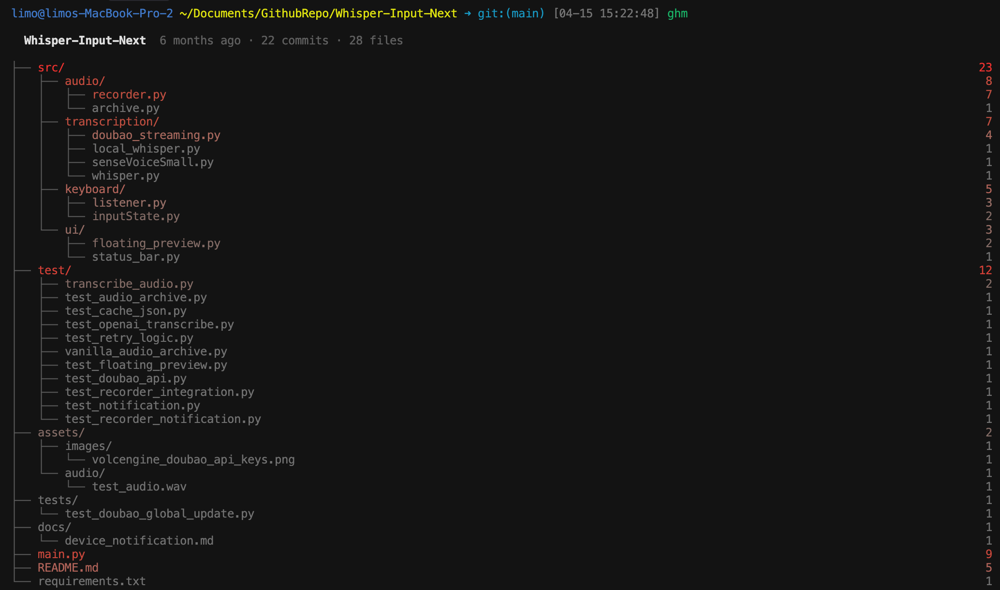

# git-heatmap

Visualize git commit frequency as a colored file tree in the terminal. See which files and directories are most actively modified at a glance — hot files glow red, cold files stay grey.



## Install

```bash
git clone https://github.com/Mor-Li/git-heatmap.git
cd git-heatmap
npm install
npm run build
npm link
```

## Usage

Run `git-heatmap` (or alias `ghm`) in any git repository:

```bash
git-heatmap                          # default: last 6 months, depth 3
git-heatmap --since "1 month ago"    # change time range
git-heatmap --depth 2                # limit tree depth
git-heatmap --top 20                 # flat mode: top 20 hottest files
git-heatmap --exclude node_modules   # exclude patterns
git-heatmap --sort alpha             # sort alphabetically
```

## Options

| Option | Description | Default |
|---|---|---|
| `-s, --since <duration>` | Time range for analysis | `6 months ago` |
| `-d, --depth <number>` | Max tree depth | `3` |
| `-n, --top <number>` | Show top N hottest files (flat mode) | - |
| `-e, --exclude <pattern...>` | Exclude files matching pattern | - |
| `--sort <method>` | Sort: `hot`, `alpha`, `count` | `hot` |

## How it works

1. Runs `git log --name-only` to collect file change counts in the given time range
2. Filters to currently tracked files (respects `.gitignore`)
3. Builds a directory tree with aggregated commit counts
4. Renders with truecolor gradient from grey (cold) to red (hot), using log scale for better color distribution

## License

MIT
